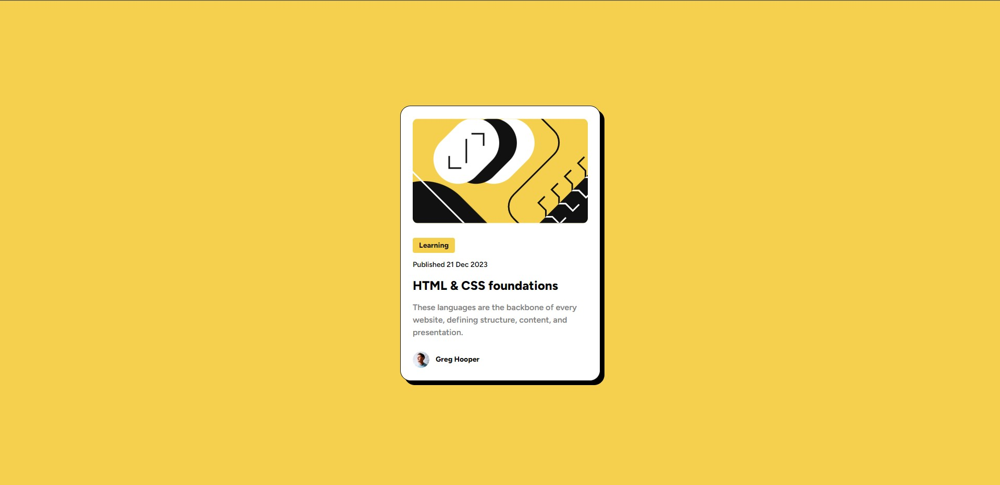

# Frontend Mentor - Blog preview card solution

This is a solution to the [Blog preview card challenge on Frontend Mentor](https://www.frontendmentor.io/challenges/blog-preview-card-ckPaj01IcS). Frontend Mentor challenges help you improve your coding skills by building realistic projects. 

## Table of contents

- [Overview](#overview)
  - [The challenge](#the-challenge)
  - [Screenshot](#screenshot)
  - [Links](#links)
- [My process](#my-process)
  - [Built with](#built-with)
- [Author](#author)

## Overview

### The challenge

Users should be able to:

- See hover and focus states for all interactive elements on the page

### Screenshot

### Links

- Solution URL: [Solution URL](https://www.frontendmentor.io/solutions/frontend-mentor-blog-preview-card-yax9wSWWqg)
- Live Site URL: [Live site URL](https://antonyermakovich.github.io/blog-preview-card/)

## My process

### Built with

- Semantic HTML5 markup
- CSS custom properties
- Flexbox
- CSS Grid
- Mobile-first workflow

## Author

- Website - [Anton Yermakovich](https://portfolio-antonyermakovichs-projects.vercel.app/)
- Frontend Mentor - [@AntonYermakovich](https://www.frontendmentor.io/profile/AntonYermakovich)
- Telegram - [@anton_yermakovich](https://t.me/anton_yermakovich)
- Instagram - [My Inst](https://www.instagram.com/antonyermakovich/)
